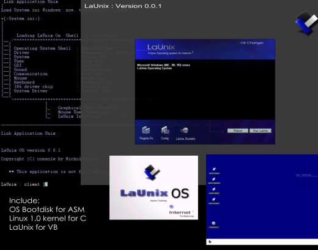

<div align="center">

## LaUnix Operating System v 0\.0\.1


</div>

### Description

First Unix was written in BCPL (Basic Combined Programming Language). In 1973, Unix OS was rewitten in C.

Today, its visual basic language. LaUnix is future OS -- (3D OS, Internet kernel, kernel will be create by you) -- born in 2004. Verison 0.0.0 wasn't success product. Now, Verison 0.0.1 includes: ASM bootable OS disk, linux kernel bootdisk source code for C, and Visual Basic source code for console, calulator, notepad, etc. Be sure to compile at C:\launix\launix.exe. (not tested on XP & NT)

Tell me what you like/dislike about this program. I'll be working next verison. I'll be adding docs how to build 3d operating system. Don't forget to vote.
 
### More Info
 


<span>             |<span>
---                |---
**Submitted On**   |
**By**             |[   ](https://github.com/Planet-Source-Code/PSCIndex/blob/master/ByAuthor/empty.md)
**Level**          |Advanced
**User Rating**    |5.0 (60 globes from 12 users)
**Compatibility**  |VB 4\.0 \(16\-bit\), VB 4\.0 \(32\-bit\), VB 5\.0, VB 6\.0, VB Script, ASP \(Active Server Pages\) 
**Category**       |[Object Oriented Programming \(OOP\)](https://github.com/Planet-Source-Code/PSCIndex/blob/master/ByCategory/object-oriented-programming-oop__1-47.md)
**World**          |[Visual Basic](https://github.com/Planet-Source-Code/PSCIndex/blob/master/ByWorld/visual-basic.md)
**Archive File**   |[](https://github.com/Planet-Source-Code/launix-operating-system-v-0-0-1__1-55059/archive/master.zip)


### Source Code

```
'To create operating system bootdisk. You need 'blank 1.44 disk. Your hard disks are not 'affected in any way. Always be sure you 'put "C:\launix\launix.exe" the code is not 'compete yet.
'------------------------------------
Download:
http://www.freewebs.com/sidecheck/download/launixos.zip
```

